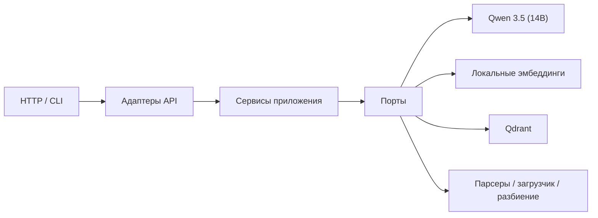

# Локальный AI/RAG-сервис на Qwen 3.5 (14B)

[](https://github.com/fazzilka/AI_Engineer_template/actions/workflows/ci.yml)

Производственная основа для полностью локальных AI API и RAG-сервисов на Python 3.14. Проект
запускает генеративную модель и эмбеддинги в локальной инфраструктуре, хранит векторы в Qdrant и
после предварительной подготовки весов работает без внешних API, ключей доступа и подключения к сети.

## Выбранная модель

В основном профиле проекта используется **Qwen 3.5 (14B)**.

**Рекомендуемое квантование:** **Q4_K_M**.

| Параметр | Значение |
| --- | --- |
| Семейство | Qwen 3.5 |
| Размер | 14B параметров |
| Формат локального артефакта | GGUF |
| Квантование | Q4_K_M |
| Режим работы | полностью локальный |
| Основные задачи | диалог, RAG, ответы по внутренней базе знаний |

Профиль Q4_K_M выбран как практичный баланс между качеством ответов, размером файла и требованиями
к памяти. Подробности, правила именования артефакта и границы совместимости приведены в
[карточке модели](docs/model-profile.md).

## Для каких задач подходит проект

- внутренние ассистенты и корпоративные базы знаний;
- RAG по PDF, Markdown, обычному тексту и HTML-страницам;
- изолированные контуры и проекты с повышенными требованиями к конфиденциальности;
- локальные прототипы и производственные сервисы с заменяемыми адаптерами;
- многоязычный поиск с подходящей моделью эмбеддингов.

## Возможности

- FastAPI API для диалога, загрузки документов, поиска, RAG, удаления и проверки состояния;
- локальная генерация через порт `ChatModel`;
- базовый адаптер Transformers/PyTorch через `HuggingFacePipeline`;
- локальные эмбеддинги через `HuggingFaceEmbeddings`;
- Qdrant в режимах `memory`, `local` и `server`;
- плотный поиск и необязательный гибридный поиск через FastEmbed;
- детерминированные тестовые модели для тестов, CI и оценок качества;
- разбор PDF через pypdf и безопасная загрузка URL с защитой от SSRF;
- стабильные идентификаторы фрагментов, контрольные суммы и идемпотентная индексация;
- структурированные ссылки на источники и ограничение объёма контекста;
- структурированные журналы, метрики Prometheus и идентификаторы запросов;
- строгая проверка типов, Ruff, покрытие ветвей не ниже 90% и автономные оценки качества;
- защищённые Docker-образы без автоматического включения весов модели.

## Архитектура



Слой `domain/` не зависит от FastAPI, LangChain, Qdrant, Torch и HTTPX. Слой `application/`
координирует сценарии через узкие порты, а конкретные интеграции находятся в `adapters/`.
Композиция и жизненный цикл тяжёлых ресурсов реализованы в `bootstrap/`. Подробнее см.
[описание архитектуры](docs/architecture.md).

## Требования

- Python 3.14;
- [uv](https://docs.astral.sh/uv/) 0.11.x;
- GNU Make;
- достаточный объём RAM или VRAM для модели Qwen 3.5 (14B) в Q4_K_M;
- Docker — только для контейнерного запуска.

## Быстрый запуск без весов модели

```bash
cp .env.example .env
make install
make check
make dev
```

Начальная конфигурация использует детерминированную тестовую модель, тестовые эмбеддинги и локальный
Qdrant в каталоге `./data/qdrant`. Документация OpenAPI доступна по адресу
`http://localhost:8000/docs`.

## Запуск с локальной моделью

Основной артефакт развёртывания называется:

```text
models/generator/qwen3.5-14b-q4_k_m.gguf
```

GGUF-квантование Q4_K_M требует реализации порта `ChatModel` на совместимом локальном рантайме,
например llama.cpp. Имеющийся в репозитории адаптер `HuggingFaceChatModel` предназначен для
Transformers-чекпойнтов и служит базовой реализацией того же порта. Не следует передавать файл GGUF
непосредственно в `AutoModelForCausalLM`.

Для режима Transformers заранее загрузите совместимый локальный снимок модели и эмбеддингов:

```bash
make model-download \
  GENERATOR_ID=<идентификатор-репозитория-модели> \
  GENERATOR_REVISION=<неизменяемая-ревизия> \
  EMBEDDING_ID=sentence-transformers/paraphrase-multilingual-MiniLM-L12-v2 \
  EMBEDDING_REVISION=<неизменяемая-ревизия>
```

Затем настройте `.env`:

```dotenv
MODEL__BACKEND=huggingface
MODEL__SOURCE=filesystem
MODEL__PATH=./models/generator
MODEL__LOCAL_FILES_ONLY=true
MODEL__TRUST_REMOTE_CODE=false
MODEL__ALIAS=qwen3.5-14b-q4_k_m

EMBEDDINGS__BACKEND=huggingface
EMBEDDINGS__SOURCE=filesystem
EMBEDDINGS__PATH=./models/embeddings
EMBEDDINGS__LOCAL_FILES_ONLY=true
```

Проверка заранее загруженной модели не входит в обычный CI и запускается отдельно:

```bash
make model-smoke
TEST_MODEL_PATH=./models/generator make test-model
```

HTTP-клиент не может выбирать идентификатор модели, путь, ревизию, устройство, параметры генерации
или адрес Qdrant. Все эти настройки принадлежат серверу.

## Полностью автономный режим

```dotenv
OFFLINE_MODE=true
HF_HUB_OFFLINE=1
WEB__ENABLED=false
MODEL__LOCAL_FILES_ONLY=true
EMBEDDINGS__LOCAL_FILES_ONLY=true
```

При `OFFLINE_MODE=true` приложение разрешает только локальные файлы моделей и отключает загрузку URL.
Отсутствующие веса приводят к контролируемой ошибке; переключения на внешний поставщик моделей нет.

## API

| Метод и путь | Назначение |
| --- | --- |
| `POST /api/v1/chat` | Диалог без серверного хранения истории |
| `POST /api/v1/documents/upload` | Загрузка одного PDF, TXT или Markdown-файла |
| `POST /api/v1/documents/url` | Безопасная загрузка HTML или текста по URL |
| `POST /api/v1/retrieval/search` | Векторный или гибридный поиск с фильтрами |
| `POST /api/v1/rag/query` | Ответ по найденному контексту со ссылками на источники |
| `DELETE /api/v1/documents/{document_id}` | Удаление всех фрагментов документа |
| `GET /api/v1/system/model` | Состояние модели, эмбеддингов и хранилища |
| `GET /health/live` | Проверка процесса и цикла событий |
| `GET /health/ready` | Проверка готовности компонентов |
| `GET /metrics` | Метрики Prometheus |

### Диалог

```bash
curl --request POST http://localhost:8000/api/v1/chat \
  --header 'Content-Type: application/json' \
  --data '{"messages":[{"role":"user","content":"Объясни локальный инференс."}]}'
```

### Загрузка PDF

```bash
curl --request POST http://localhost:8000/api/v1/documents/upload \
  --form 'file=@./document.pdf;type=application/pdf'
```

### Загрузка URL

```bash
curl --request POST http://localhost:8000/api/v1/documents/url \
  --header 'Content-Type: application/json' \
  --data '{"url":"https://example.com/article"}'
```

Запрещены приватные, loopback, link-local, multicast-адреса и URL со встроенными учётными данными.
Каждое перенаправление проверяется повторно.

### Поиск

```bash
curl --request POST http://localhost:8000/api/v1/retrieval/search \
  --header 'Content-Type: application/json' \
  --data '{
    "query":"Как работает автономный режим?",
    "top_k":5,
    "filters":{"source_types":["pdf","markdown"]}
  }'
```

### RAG-запрос

```bash
curl --request POST http://localhost:8000/api/v1/rag/query \
  --header 'Content-Type: application/json' \
  --data '{"query":"Что сказано о локальном хранении?","top_k":5}'
```

Сокращённый ответ:

```json
{
  "answer": "… [source-1]",
  "model": "qwen3.5-14b-q4_k_m",
  "usage": {
    "input_tokens": 100,
    "output_tokens": 30,
    "total_tokens": 130,
    "estimated": false
  },
  "sources": [
    {
      "citation_id": "source-1",
      "document_id": "…",
      "chunk_id": "…",
      "title": "document",
      "source": "document.pdf",
      "source_type": "pdf",
      "page_number": 4,
      "score": 0.84,
      "snippet": "…"
    }
  ]
}
```

## Индексация через CLI

CLI использует те же сервисы приложения, что и HTTP API:

```bash
uv run ai-template-ingest file ./document.pdf
uv run ai-template-ingest file ./notes.md
uv run ai-template-ingest url https://example.com/article
```

## Режимы Qdrant

- `memory` — тесты, оценки качества и временные проверки;
- `local` — встроенное постоянное хранилище в `QDRANT__PATH`;
- `server` — отдельный сервер Qdrant по HTTP или gRPC.

```dotenv
QDRANT__MODE=server
QDRANT__URL=http://qdrant:6333
QDRANT__PREFER_GRPC=true
```

Для гибридного поиска:

```bash
make install-all
```

```dotenv
QDRANT__RETRIEVAL_MODE=hybrid
QDRANT__SPARSE_MODEL_ID=Qdrant/bm25
QDRANT__SPARSE_CACHE_DIR=./models/fastembed
```

Метаданные коллекции фиксируют отпечаток эмбеддингов, размерность, метрику расстояния, режим поиска
и имена векторов. При несовместимости необходимо выбрать новую коллекцию или выполнить переиндексацию.

## Вычислительные устройства

- CPU: `MODEL__DEVICE=cpu`, `EMBEDDINGS__DEVICE=cpu`;
- Apple Silicon: `MODEL__DEVICE=mps`;
- CUDA: установите сборку PyTorch, совместимую с драйвером, и задайте `MODEL__DEVICE=cuda`;
- автоматический выбор: `MODEL__DEVICE=auto` использует порядок CUDA → MPS → CPU.

Каждый процесс Uvicorn загружает собственную копию модели. По умолчанию используется один рабочий
процесс; горизонтальное масштабирование выполняется отдельными репликами.

## Docker Compose

```bash
cp .env.example .env
make docker-build
make up
make logs
```

Веса не включаются в образ и подключаются через том `model_data`. Локальный Qdrant использует том
`app_data`. Для отдельного сервера Qdrant:

```bash
make qdrant-up
# В .env укажите QDRANT__MODE=server и QDRANT__URL=http://qdrant:6333
make up
```

Контейнеры работают без root-прав, с файловой системой только для чтения, отключёнными Linux
capabilities и параметром `no-new-privileges`.

## Конфигурация

Все настройки принадлежат серверу и используют разделитель вложенности `__`. Полный пример находится
в файле [`.env.example`](.env.example).

| Группа | Основные параметры |
| --- | --- |
| `APP__*`, `API__*` | окружение, политика тестовых адаптеров, префикс, OpenAPI |
| `MODEL__*` | источник, путь, ревизия, устройство, тип данных, лимиты и тайм-аут |
| `EMBEDDINGS__*` | источник, нормализация, размер пакета и префиксы |
| `QDRANT__*` | режим хранилища, схема коллекции и режим поиска |
| `CHUNKING__*` | размер и перекрытие фрагментов |
| `INGESTION__*` | лимиты файлов, страниц и извлечённого текста |
| `WEB__*` | политика SSRF, перенаправления, тайм-ауты и размер ответа |
| `RAG__*` | ограничения контекста, релевантности и цитат |

`trust_remote_code` никогда не включается автоматически. Явное значение `true` фиксируется
предупреждением в журнале.

## Тестирование и контроль качества

```bash
make test-unit
make test-integration
make check
make security
make build
```

Обычные тесты используют тестовые адаптеры и Qdrant в памяти. Им не нужны токены, Docker, сеть или
веса модели. Доступные маркеры: `unit`, `integration`, `model`, `network`, `slow`.

## Оценки качества

```bash
make eval
```

Наборы в `evals/cases/` проверяют диалог, поиск, RAG и безопасность. Рассчитываются hit-rate@K, MRR,
recall@K, наличие ожидаемых фрагментов, корректность цитат, отказ при отсутствии ответа и устойчивость
к внедрению инструкций. Стандартный набор полностью детерминирован и работает без сети.

## Наблюдаемость

- структурированные события жизненного цикла, генерации, поиска и индексации без содержимого данных;
- безопасный идентификатор каждого HTTP-запроса;
- метрики HTTP, загрузки модели, генерации, токенов, эмбеддингов, поиска и документов;
- метки с низкой кардинальностью без URL, имён файлов, запросов и текста исключений;
- liveness не запускает генерацию, а readiness не скачивает и не прогревает лениво загружаемую модель.

## Безопасность

Основные меры: запрет выбора модели и путей через HTTP, ограничения загрузок, очистка имён файлов,
защита от SSRF, ограничение потоковых ответов, серверные системные промпты, изоляция найденного
контекста, `trust_remote_code=false`, безопасные публичные ошибки, аудит зависимостей и защищённые
контейнеры. Подробнее: [политика безопасности](SECURITY.md) и
[модель угроз](docs/security.md).

## Лицензии моделей

Перед использованием выбранного артефакта Qwen 3.5 (14B) необходимо проверить его происхождение,
лицензию, допустимые сценарии применения, ограничения распространения и контрольную сумму. Веса
модели исключены из Git и контекста сборки Docker.

## Использование как шаблона GitHub

После нажатия **Use this template**:

1. измените название пакета и метаданные проекта;
2. зарегистрируйте точную ревизию и контрольную сумму модельного артефакта;
3. замените системные промпты и наборы оценок требованиями продукта;
4. определите правила аутентификации, авторизации, хранения и резервного копирования;
5. при смене эмбеддингов создайте новую коллекцию или план переиндексации.

## Расширение проекта

Рецепты добавления OCR, повторного ранжирования, авторизации, очередей и нескольких реплик находятся
в [руководстве по расширению](docs/extensions.md).

## Миграция

Переход с внешних поставщиков моделей на локальный профиль Qwen 3.5 (14B) описан в
[руководстве по миграции](docs/migration-local-models.md).

## Известные ограничения

- качество зависит от конкретного артефакта Qwen 3.5 (14B), промптов и набора данных;
- первая загрузка и прогрев могут занимать значительное время;
- каждый рабочий процесс дублирует потребление RAM или VRAM;
- тайм-аут ограничивает ожидание запроса, но не всегда останавливает уже начатый поток Torch;
- OCR не входит в базовую поставку, поэтому PDF без текстового слоя отклоняются;
- страницы, полностью создаваемые JavaScript, не поддерживаются;
- замена версии документа в Qdrant не является транзакцией между несколькими системами;
- проверка настоящей модели не запускается в стандартном CI;
- кэш разреженной модели для гибридного поиска подготавливается отдельно;
- подбор оборудования и соблюдение лицензии остаются ответственностью владельца развёртывания.
