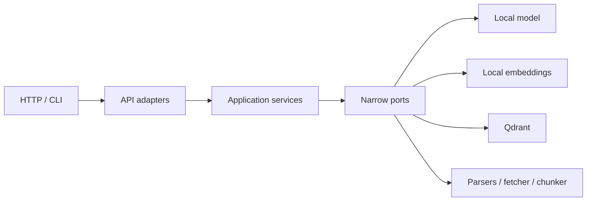

# Local AI Engineer Template

[](https://github.com/fazzilka/AI_Engineer_template/actions/workflows/ci.yml)

Production-oriented foundation для полностью локальных AI API и RAG-сервисов на Python 3.14. Шаблон
запускает генеративную модель и embeddings внутри процесса, хранит vectors локально в Qdrant и после
предварительного скачивания моделей способен работать без model API, ключей и сети.

Это прочная основа для адаптации, а не обещание готовности к любому production-окружению без
дополнительных authentication, capacity planning, model validation и deployment controls.

## Для каких проектов подходит

- внутренние knowledge assistants и локальные copilots;
- RAG по PDF, Markdown, plain text и HTML URL;
- изолированные или privacy-sensitive deployments;
- прототипы и production-oriented сервисы с заменяемыми adapters;
- multilingual retrieval с подходящей sentence-transformers моделью.

## Возможности

- FastAPI API: chat, upload, URL ingestion, retrieval, RAG, delete, status, health и metrics;
- in-process inference через Transformers, PyTorch и `HuggingFacePipeline`;
- локальные embeddings через `HuggingFaceEmbeddings`;
- Qdrant memory/local/server modes, dense retrieval и optional FastEmbed hybrid retrieval;
- deterministic fake model и fake embeddings для quick start, tests, CI и evals;
- PDF parsing через pypdf, безопасный HTTPX fetcher и SSRF protection;
- deterministic chunk IDs, checksums, idempotent ingestion и version replacement;
- structured citations и bounded context;
- structlog, Prometheus, request ID и component readiness;
- strict mypy, Ruff, pytest branch coverage ≥90%, offline evals и dependency audit;
- hardened Docker/Compose без автоматического скачивания weights.

## Архитектура



`domain/` не знает о FastAPI, LangChain, Qdrant, Torch и HTTPX. `application/` оркестрирует use cases,
а concrete integrations живут в `adapters/`. `bootstrap/` создаёт и закрывает тяжёлые ресурсы через
FastAPI lifespan. Подробности: [docs/architecture.md](docs/architecture.md).

## Требования

- Python 3.14;
- [uv](https://docs.astral.sh/uv/) 0.11.x;
- GNU Make;
- достаточно RAM/VRAM для выбранных моделей;
- Docker — только для container workflow.

## Quick start без скачивания моделей

```bash
cp .env.example .env
make install
make check
make dev
```

Defaults используют fake model, fake embeddings и persistent local Qdrant в `./data/qdrant`.
Откройте `http://localhost:8000/docs`.

## Quick start с настоящими локальными моделями

Выберите совместимую causal/text-to-text model и embedding model, проверьте их licenses и зафиксируйте
точные Hugging Face revisions. Скачивание всегда явное:

```bash
make model-download \
  GENERATOR_ID=organization/generator-model \
  GENERATOR_REVISION=<commit-sha> \
  EMBEDDING_ID=sentence-transformers/paraphrase-multilingual-MiniLM-L12-v2 \
  EMBEDDING_REVISION=<commit-sha>
```

Затем измените `.env`:

```dotenv
MODEL__BACKEND=huggingface
MODEL__SOURCE=filesystem
MODEL__PATH=./models/generator
MODEL__LOCAL_FILES_ONLY=true
MODEL__TRUST_REMOTE_CODE=false
MODEL__ALIAS=my-local-model

EMBEDDINGS__BACKEND=huggingface
EMBEDDINGS__SOURCE=filesystem
EMBEDDINGS__PATH=./models/embeddings
EMBEDDINGS__LOCAL_FILES_ONLY=true
```

Проверка pre-downloaded generator без участия обычного CI:

```bash
make model-smoke
TEST_MODEL_PATH=./models/generator make test-model
```

Cache mode использует уже существующий Hugging Face cache:

```dotenv
MODEL__SOURCE=cache
MODEL__ID=organization/model-name
MODEL__REVISION=<commit-sha>
MODEL__LOCAL_FILES_ONLY=true
```

HTTP-клиент не может выбирать model ID, path, revision, device, generation parameters или Qdrant URL.

## Настоящий offline mode

```dotenv
OFFLINE_MODE=true
HF_HUB_OFFLINE=1
WEB__ENABLED=false
MODEL__LOCAL_FILES_ONLY=true
EMBEDDINGS__LOCAL_FILES_ONLY=true
```

При `OFFLINE_MODE=true` приложение принудительно включает local-only для обеих моделей и отключает URL
ingestion. Отсутствующие weights приводят к безопасной ошибке с подсказкой запустить `make
model-download`; runtime не переключается на внешний inference provider.

## API

| Endpoint | Назначение |
| --- | --- |
| `POST /api/v1/chat` | Stateless chat с server-owned system prompt |
| `POST /api/v1/documents/upload` | Multipart upload одного PDF/TXT/Markdown |
| `POST /api/v1/documents/url` | Безопасная загрузка HTML/text URL |
| `POST /api/v1/retrieval/search` | Dense/sparse/hybrid search с typed filters |
| `POST /api/v1/rag/query` | Grounded answer и structured citations |
| `DELETE /api/v1/documents/{document_id}` | Удалить все chunks документа |
| `GET /api/v1/system/model` | Безопасный model/embedding/storage status |
| `GET /health/live` | Проверить процесс и event loop |
| `GET /health/ready` | Проверить container, embeddings и Qdrant compatibility |
| `GET /metrics` | Prometheus exposition |

### Plain chat

```bash
curl --request POST http://localhost:8000/api/v1/chat \
  --header 'Content-Type: application/json' \
  --data '{"messages":[{"role":"user","content":"Объясни local inference."}]}'
```

### Upload PDF

```bash
curl --request POST http://localhost:8000/api/v1/documents/upload \
  --form 'file=@./document.pdf;type=application/pdf'
```

### Ingest URL

```bash
curl --request POST http://localhost:8000/api/v1/documents/url \
  --header 'Content-Type: application/json' \
  --data '{"url":"https://example.com/article"}'
```

Private, loopback, link-local, multicast и credentialed URLs запрещены; redirects проверяются заново.

### Retrieval

```bash
curl --request POST http://localhost:8000/api/v1/retrieval/search \
  --header 'Content-Type: application/json' \
  --data '{
    "query":"Как работает offline mode?",
    "top_k":5,
    "filters":{"source_types":["pdf","markdown"]}
  }'
```

### RAG query

```bash
curl --request POST http://localhost:8000/api/v1/rag/query \
  --header 'Content-Type: application/json' \
  --data '{"query":"Что сказано о локальном хранении?","top_k":5}'
```

Сокращённый response:

```json
{
  "answer": "… [source-1]",
  "model": "my-local-model",
  "usage": {
    "input_tokens": 100,
    "output_tokens": 30,
    "total_tokens": 130,
    "estimated": false
  },
  "sources": [
    {
      "citation_id": "source-1",
      "document_id": "…",
      "chunk_id": "…",
      "title": "document",
      "source": "document.pdf",
      "source_type": "pdf",
      "page_number": 4,
      "score": 0.84,
      "snippet": "…"
    }
  ]
}
```

## CLI ingestion

CLI вызывает те же application services, что и API:

```bash
uv run ai-template-ingest file ./document.pdf
uv run ai-template-ingest file ./notes.md
uv run ai-template-ingest url https://example.com/article
```

## Qdrant modes

- `memory`: tests, evals и ephemeral smoke checks;
- `local` (default): embedded persistent storage в `QDRANT__PATH`;
- `server`: отдельный Qdrant по `QDRANT__URL`, optional gRPC.

```dotenv
QDRANT__MODE=server
QDRANT__URL=http://qdrant:6333
QDRANT__PREFER_GRPC=true
```

Hybrid retrieval:

```bash
make install-all
```

```dotenv
QDRANT__RETRIEVAL_MODE=hybrid
QDRANT__SPARSE_MODEL_ID=Qdrant/bm25
QDRANT__SPARSE_CACHE_DIR=./models/fastembed
```

Без optional extra dense mode продолжает работать, а sparse/hybrid configuration завершается понятной
ошибкой. Sparse model cache нужно подготовить до изолированного deployment.

Collection metadata фиксирует embedding fingerprint, dimension, distance, retrieval mode и vector
names. Несовместимая коллекция не используется молча: выберите другое имя, удалите index или выполните
reindex.

## CPU, Apple Silicon и CUDA

- CPU: `MODEL__DEVICE=cpu`, `EMBEDDINGS__DEVICE=cpu`; начните с компактной модели.
- Apple Silicon: `MODEL__DEVICE=mps`; auto выбирает MPS после проверки CUDA.
- CUDA: установите совместимую с host driver сборку PyTorch согласно официальной инструкции PyTorch и
  задайте `MODEL__DEVICE=cuda`. CUDA-specific packages не входят в baseline.
- `MODEL__DEVICE=auto`: CUDA → MPS → CPU.

Каждый Uvicorn worker загружает отдельную копию model weights. Поэтому default — один worker; scale-out
лучше выполнять отдельными replicas. Prometheus multiprocess mode нужен только при сознательном
переходе к нескольким process workers.

## Docker Compose

```bash
cp .env.example .env
make docker-build
make up
make logs
```

Weights не входят в image и подключаются через `model_data`; local Qdrant использует `app_data`.
Отдельный server profile:

```bash
make qdrant-up
# Укажите QDRANT__MODE=server и QDRANT__URL=http://qdrant:6333 в .env
make up
```

Контейнеры запускаются non-root, с read-only root filesystem, dropped capabilities и
`no-new-privileges`. Жёсткие memory limits не заданы: подберите requests/limits по выбранным weights.

## Конфигурация

Все настройки server-owned и используют `env_nested_delimiter="__"`. Полный, исполняемый reference —
[`.env.example`](.env.example).

| Группа | Основные параметры |
| --- | --- |
| `APP__*`, `API__*` | environment, fake policy, prefix, docs |
| `MODEL__*` | backend, source, ID/path/revision, device/dtype, limits, concurrency, timeout |
| `EMBEDDINGS__*` | backend, local source, normalize, batch size, prefixes |
| `QDRANT__*` | memory/local/server, collection schema, retrieval mode, top K |
| `CHUNKING__*` | deterministic size, overlap, separators |
| `INGESTION__*` | bytes, PDF pages, extracted character limits |
| `WEB__*` | enable switch, SSRF policy, redirects, timeouts, response limit |
| `RAG__*` | context chunks/characters/tokens, relevance and snippet bounds |

`trust_remote_code` никогда не включается автоматически. При явном `true` появляется warning log.

## Tests и quality gates

```bash
make test-unit
make test-integration
make check
make security
make build
```

Обычные tests используют fake adapters и Qdrant memory mode, не требуют token, Docker, сети или model
downloads. Markers: `unit`, `integration`, `model`, `network`, `slow`.

## Evals

```bash
make eval
```

Version-controlled suites находятся в `evals/cases/`: chat, retrieval, RAG и security. Gate считает
hit-rate@K, MRR, recall@K, answer fragments, citations, no-answer и prompt-injection cases. Default
evals полностью deterministic и offline-safe.

## Observability

- structured lifecycle, generation, embedding, retrieval и ingestion events без prompt/document body;
- request ID принимается только в безопасном формате или генерируется сервером;
- Prometheus HTTP, model load/generation/token, embedding, retrieval, ingestion и document metrics;
- low-cardinality labels без URL, filename, document ID, query и exception text;
- liveness не выполняет inference; readiness не скачивает и не прогревает lazy model.

## Security

Ключевые границы: no arbitrary model/path/endpoint from HTTP, upload/PDF/text limits, filename
sanitization, SSRF и redirect validation, response streaming limit, server-owned prompts, escaped
retrieved context, `trust_remote_code=false`, safe public errors, dependency audit и hardened containers.
Подробнее: [SECURITY.md](SECURITY.md) и [docs/security.md](docs/security.md).

## Model licenses

Template не определяет, какую модель можно использовать в вашем продукте. До скачивания проверьте
license, acceptable-use policy, geographic restrictions, training-data implications и право на
commercial redistribution. Model files намеренно исключены из Git и Docker build context.

## Использование как GitHub Template

После **Use this template**:

1. переименуйте package/project metadata;
2. выберите и зафиксируйте revisions локальных моделей;
3. замените prompts и eval fixtures продуктовой спецификой;
4. определите authentication, authorization, retention и backup policies;
5. при смене embeddings создайте новую collection или migration/reindex plan.

## Extension recipes

Рецепты OCR, reranking, authentication, queues, object storage, multiple replicas и tracing находятся
в [docs/extensions.md](docs/extensions.md). Они не являются обязательными dependencies baseline.

## Migration

Переход с прежнего remote-provider template описан в
[docs/migration-local-models.md](docs/migration-local-models.md). Старые credentials и runtime provider
calls удалены намеренно.

## Known limitations

- качество и language coverage зависят от выбранных generator/embedding models;
- первая загрузка и warmup могут занимать заметное время;
- каждый process worker дублирует RAM/VRAM;
- timeout ограничивает ожидание, но Python thread cancellation не всегда физически останавливает уже
  начатый Torch inference;
- OCR не входит в baseline, поэтому scanned PDF без text layer отклоняется;
- JavaScript-rendered pages не поддерживаются;
- Qdrant version replacement максимально безопасен, но не является cross-system transaction;
- real-model smoke не выполняется обычным CI;
- sparse model cache для hybrid mode подготавливается отдельно;
- model licensing и hardware sizing остаются ответственностью пользователя.
