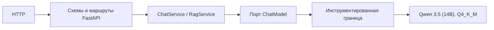
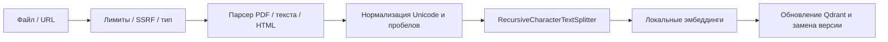
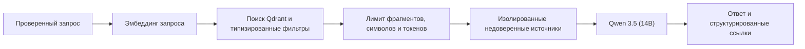

# Архитектура

Проект использует подход «порты и адаптеры». Зависимости направлены к центру:

```text
API / CLI → Приложение → Порты → Домен
                         ↑
                      Адаптеры
```

`domain/` содержит неизменяемые классы данных, перечисления, правила формирования идентификаторов и
типизированные ошибки. Этот слой не импортирует транспортные, модельные, поисковые или
наблюдаемые фреймворки. `application/` координирует сценарии через порты. Типы LangChain и сторонних
SDK преобразуются только внутри адаптеров.

## Модельный профиль

Для основного развёртывания выбран профиль **Qwen 3.5 (14B)**.

**Рекомендуемое квантование:** **Q4_K_M**.

Квантованный артефакт хранится вне Git в формате GGUF. Архитектура не привязывает прикладной слой к
конкретному рантайму: Qwen подключается через порт `ChatModel`. Это позволяет использовать
llama.cpp-совместимый адаптер для Q4_K_M, сохраняя существующий Transformers-адаптер для локальных
чекпойнтов в формате Hugging Face. Подробности приведены в [карточке модели](model-profile.md).

## Обработка запроса



Клиент передаёт историю диалога, но не может передать системный промпт, модель, путь, ревизию,
устройство, адрес рантайма или параметры генерации. Синхронный инференс выполняется за границей потока
AnyIO, а локальный семафор ограничивает число одновременных генераций.

## Индексация документов



API передаёт байты загруженного файла и никогда не принимает произвольный серверный путь. Загрузка URL
и разбор HTML реализованы отдельными адаптерами. Логический документ получает стабильный UUIDv5 по
источнику, а контрольная сумма содержимого становится версией. UUIDv5 фрагмента вычисляется по
идентификатору документа, версии, порядковому номеру и контрольной сумме фрагмента. Повторная загрузка
того же содержимого возвращает `unchanged`; новая версия записывается до удаления устаревших точек.

## Обработка RAG-запроса



RAG реализован как явный конвейер из поиска и генерации, а не как скрытая высокоуровневая цепочка.
Контекст состоит из экранированных блоков источников, серверного промпта и отдельного вопроса.
Инструкции из документов не могут заменить системные инструкции. Если релевантного контекста
недостаточно, сервис возвращает явный ответ об отсутствии данных.

## Жизненный цикл модели

Корень композиции находится в `bootstrap/container.py`; FastAPI lifespan вызывает `start()` и
`aclose()`. Модель не загружается при импорте модуля или для каждого запроса.

- `MODEL__LOAD_ON_STARTUP=false` включает ленивую загрузку;
- при ранней загрузке модель загружается и прогревается один раз;
- асинхронная блокировка предотвращает повторную параллельную загрузку;
- семафор по умолчанию разрешает одну генерацию одновременно;
- при завершении освобождаются ссылки на модель и токенизатор, а кэши ускорителя очищаются;
- прикладной тайм-аут ограничивает ожидание запроса.

Поток вычисления может продолжить работу после тайм-аута, если базовый рантайм не поддерживает
прерывание. Поэтому место в семафоре освобождается только после фактического завершения рабочего потока.

Эмбеддинги инициализируются раньше Qdrant, поскольку размерность и отпечаток модели входят в инварианты
коллекции.

## Почему по умолчанию один рабочий процесс

Каждый процесс Uvicorn владеет отдельной моделью, токенизатором и памятью ускорителя. Несколько процессов
умножают потребление RAM и VRAM, что особенно заметно для профиля 14B. Поэтому по умолчанию используется
один процесс, а масштабирование выполняется отдельными репликами.

## Режимы Qdrant и совместимость

- `memory` — изолированные тесты и оценки качества;
- `local` — постоянная встроенная база в `QDRANT__PATH`;
- `server` — Qdrant по HTTP или gRPC с ограниченными повторами запросов.

Плотный поиск включён в базовую установку. Дополнение `hybrid` добавляет разреженные векторы FastEmbed
и слияние RRF. При отсутствии дополнения разреженный и гибридный режимы завершаются понятной ошибкой.

При запуске проверяются:

- отпечаток эмбеддингов: источник, ревизия, нормализация, размерность и префиксы;
- размерность и метрика плотного вектора;
- имена плотного и разреженного векторов;
- режим поиска и идентификатор разреженной модели.

Несовместимость приводит к `CollectionCompatibilityError`. Допустимые варианты миграции: новая
коллекция, контролируемое пересоздание индекса или полная переиндексация.

## Автономная работа

`OFFLINE_MODE=true` устанавливает `HF_HUB_OFFLINE=1`, запрещает сетевую загрузку моделей и отключает
индексацию URL. Диалог, поиск и RAG по уже сохранённым данным продолжают работать. Загрузка весов всегда
выполняется отдельной явной командой и не запускается при установке, сборке образа, тестировании,
проверке готовности или в CI.

## Граница защиты от внедрения инструкций

Промпты хранятся как версионируемые ресурсы. RAG-контекст экранируется и отделяется, а ссылки на
источники создаются из поисковых метаданных, а не из текста модели. Эти меры снижают риск, но ответ
Qwen не является решением об авторизации. Любое действие с побочными эффектами требует отдельной
проверки прав и входных данных.

## Граница наблюдаемости

Инструментирование оборачивает порты и сервисы. Домен и приложение не импортируют Prometheus или
structlog. Журналы и метки содержат только ограниченные операционные данные и не включают промпты,
ответы, документы, URL, имена файлов, учётные данные или локальные пути модели.

## Точки расширения

- реализация `ChatModel` для другого локального рантайма;
- реализация `EmbeddingModel` с планом миграции и переиндексации;
- реализация `VectorStore` с теми же гарантиями совместимости и идемпотентности;
- новые парсеры за портом `DocumentParser`;
- новый загрузчик URL с повторной SSRF-проверкой каждого перенаправления;
- повторное ранжирование между поиском и ограничением контекста.

## Принятые решения

1. Модель Qwen 3.5 (14B) работает локально и не требует внешнего API.
2. Q4_K_M используется как рекомендуемый профиль GGUF для локального развёртывания.
3. Прикладной слой зависит от `ChatModel`, а не от конкретного модельного рантайма.
4. pypdf используется для разбора PDF с сохранением номеров страниц.
5. Локальный Qdrant является основным встроенным хранилищем, режим памяти предназначен для тестов.
6. Тестовые адаптеры обеспечивают детерминированные CI и оценки без сети.
7. Установка и сборка никогда не скачивают веса моделей.
8. Диалог не зависит от Qdrant, а RAG явно разделяет поиск и генерацию.
9. Конфигурация модели принадлежит серверу.
10. Типы LangChain не выходят за границы адаптеров.
