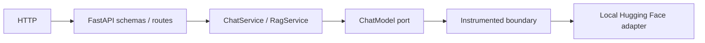
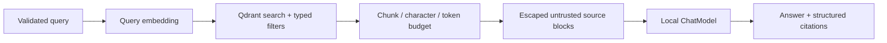

# Architecture

The template follows ports and adapters. Dependencies point inward:

```text
API / CLI → Application → Ports → Domain
                         ↑
                      Adapters
```

`domain/` contains immutable dataclasses, enums, deterministic identity rules, and typed errors. It
does not import transport, model, retrieval, logging, or metrics frameworks. `application/` coordinates
use cases through ports. LangChain and third-party SDK types are translated only inside adapters.

## Request flow



The client supplies chat history but never a system prompt, model, path, revision, device, endpoint, or
generation configuration. Synchronous Transformers inference crosses an AnyIO thread boundary and a
process-local semaphore bounds concurrent generations.

## Ingestion flow


The API passes upload bytes, never an arbitrary server path. URL fetching and HTML parsing are separate
adapters. Every logical document has a stable UUIDv5 based on source identity; the content checksum is
the version. Chunk IDs are UUIDv5 values over document ID, version, index, and chunk checksum. Repeating
identical content returns `unchanged`; changed content is upserted before stale point IDs are deleted.

## RAG flow



RAG is an explicit two-step pipeline, not a hidden high-level chain. Context uses escaped source blocks,
a server-owned prompt, bounded snippets, and a separate question element. Retrieved instructions cannot
replace system instructions. Insufficient retrieval produces an explicit no-answer result.

## Model lifecycle

The composition root is `bootstrap/container.py`; FastAPI lifespan calls `start()` and `aclose()`.
Models are never loaded on module import or per request.

- `MODEL__LOAD_ON_STARTUP=false`: lazy generator; readiness reports `ready_with_lazy_model`.
- eager mode: load once, warm up once, then mark ready.
- an async lock prevents duplicate loads;
- a semaphore defaults generation concurrency to one;
- model/tokenizer references are released at shutdown and accelerator caches are cleared when safe;
- application timeout limits request waiting. A timed-out Torch thread may continue until the underlying
  inference returns, so semaphore capacity is released by the worker completion callback rather than by
  timeout alone.

Embeddings initialize before Qdrant because vector dimension and fingerprint are collection invariants.

## Why one worker is the default

Each Uvicorn process owns its own Python heap, model, tokenizer, Torch allocator, RAM, and VRAM. Multiple
workers therefore multiply model memory. The default is one worker; capacity scaling should use explicit
replicas. Prometheus multiprocess mode is a separate deployment decision.

## Qdrant modes and compatibility

- `memory`: isolated tests and evals;
- `local`: embedded persistent database under `QDRANT__PATH`;
- `server`: Qdrant HTTP/gRPC with bounded retries for transport/server failures.

Dense retrieval is baseline. The `hybrid` extra adds FastEmbed sparse vectors and RRF fusion; sparse and
hybrid settings fail clearly when the extra is absent.

Collection metadata and schema are checked on startup:

- embedding fingerprint (canonical model reference, revision, normalization, dimension, prefixes);
- dense dimension and distance;
- dense/sparse vector names;
- retrieval mode and sparse model ID.

A mismatch raises `CollectionCompatibilityError`; silently querying vectors created by another embedding
configuration is forbidden. Migration choices are a new collection, destructive index recreation, or a
controlled reindex.

## Offline operation

`OFFLINE_MODE=true` sets `HF_HUB_OFFLINE=1`, forces both model adapters to local files only, and disables
URL ingestion. Chat, retrieval, and RAG over existing Qdrant data continue to work. Model download is a
separate explicit CLI command and never runs during install, image build, tests, readiness, or CI.

## Prompt injection boundary

Prompts are version-controlled assets. RAG context is escaped and delimited, citations are created from
retrieval metadata rather than model prose, and the prompt explicitly treats documents as untrusted.
This reduces risk but does not make arbitrary model output a security decision; downstream actions still
require authorization and validation.

## Observability boundary

Instrumentation wraps ports and services. Domain/application types do not import Prometheus or structlog.
Logs and labels contain bounded operational metadata, never prompt, answer, document body, URL, filename,
credentials, or local model paths.

## Extension points

- implement `ChatModel` for another in-process local runtime after an architectural decision;
- implement `EmbeddingModel` and provide a collection migration/reindex plan;
- implement `VectorStore` with equivalent compatibility and idempotency semantics;
- add parsers behind `DocumentParser` without exposing framework document types;
- add a fetcher only if it preserves redirect-by-redirect SSRF validation and body limits;
- add reranking between retrieval and context budgeting.

## Architecture decisions

1. In-process Hugging Face inference instead of a provider API keeps runtime local and credentials-free.
2. pypdf replaces the deprecated predecessor package and preserves page metadata.
3. Embedded local Qdrant is the default real-storage mode; memory is for tests.
4. Fake adapters make CI and evals deterministic and offline-safe.
5. Install/build never download model weights.
6. Chat remains stateless and does not depend on Qdrant.
7. RAG is explicit retrieval followed by explicit generation.
8. Model configuration is server-owned.
9. LangChain stays in adapters and never becomes a domain model.
