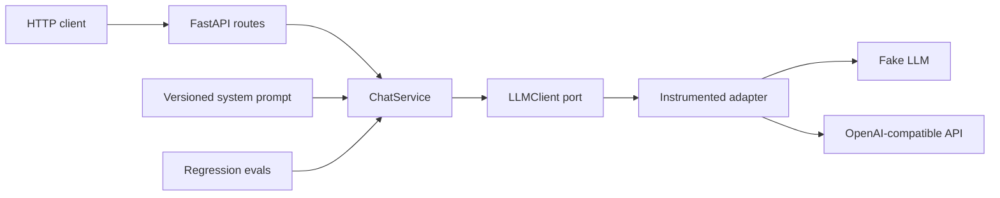

# Architecture

The template uses ports and adapters around one complete chat use case. The layering is intentionally
small: it protects core behavior from SDK churn without turning the starter into a framework of its own.

## Dependency boundaries

- `app/domain` owns stable chat and generation models.
- `app/ports` defines capabilities the application needs.
- `app/application` coordinates a use case without importing FastAPI, OpenAI, or Prometheus.
- `app/adapters` translates between a provider SDK and the port.
- `app/api` validates untrusted input and maps transport models to the domain.
- `app/observability` adds request IDs, structured logs, latency, request, and token metrics.

Dependencies point inward. A provider SDK may know about the domain contract; the domain never knows
about a provider SDK.

## Request lifecycle

1. The middleware validates or creates a request ID and starts HTTP timing.
2. The route validates message roles, lengths, and the final-user-message invariant.
3. `ChatService` adds the packaged system prompt and invokes the `LLMClient` port.
4. The instrumented adapter records provider latency, outcome, and reported token usage.
5. The concrete adapter applies timeouts and bounded retries, then returns a provider-neutral result.
6. Provider failures become a stable `503` contract without exposing internal details to the client.

## Extension recipes

### Add another model provider

Implement `LLMClient` under `app/adapters/llm`, translate its response into `GenerationResult`, and add
the provider to `LLMSettings` plus the factory. Keep retries and provider-specific errors inside the
adapter. Add contract tests using a mock transport rather than a live account.

### Add RAG

Define retrieval and document-store ports, implement adapters for the chosen database, and orchestrate
retrieval in a new application service. Do not make vector storage a global dependency of chat: some
projects will not need it. Keep source attribution in an explicit domain result instead of embedding it
only in generated text.

### Add tools or agents

Model tool requests and results in the domain first. Put side effects behind narrow ports and enforce
authorization before execution. Add maximum-step, timeout, and budget limits; record tool traces; and
include failure and prompt-injection cases in `evals/`.

### Add asynchronous jobs

Keep the use case callable independently of FastAPI, then invoke it from a queue consumer adapter. Pass
correlation IDs through job metadata and preserve idempotency at the application boundary.

## Production checklist

- Select a real provider and model through environment variables.
- Store API keys in a secret manager; never commit `.env`.
- Set `APP_ENV=production` and usually `DOCS_ENABLED=false`.
- Put authentication, authorization, rate limiting, and request-size limits at the API gateway or app.
- Restrict access to `/metrics` and health endpoints as required by the deployment environment.
- Replace sample eval cases with product-specific golden cases and define an acceptable pass threshold.
- Add persistence only for data that the product actually needs, with retention and deletion policies.
- Export logs and Prometheus metrics, and alert on error rate, latency, token use, and eval regressions.
- Review model-provider data retention and regional processing settings before sending sensitive data.

Readiness currently means that configuration, the prompt, and the application graph initialized
successfully. It deliberately does not call the paid model provider on every probe. Add dependency-specific
checks if your orchestrator needs deeper readiness semantics.
